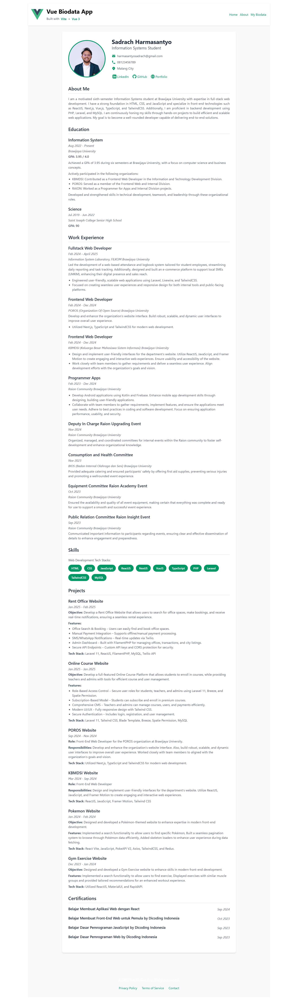

# Vue Biodata

A modern, responsive CV/resume web application built with Vue 3, TypeScript, and Tailwind CSS. This application showcases personal information, education history, work experience, skills, and projects in a clean, professional format.

## Features

- Responsive design that works on mobile, tablet, and desktop
- Clean, modern UI using Tailwind CSS
- Type-safe code with TypeScript
- Component-based architecture with Vue 3
- Easy to customize and extend

## Tech Stack

- Vue 3
- TypeScript
- Tailwind CSS
- Vue Router
- Vite